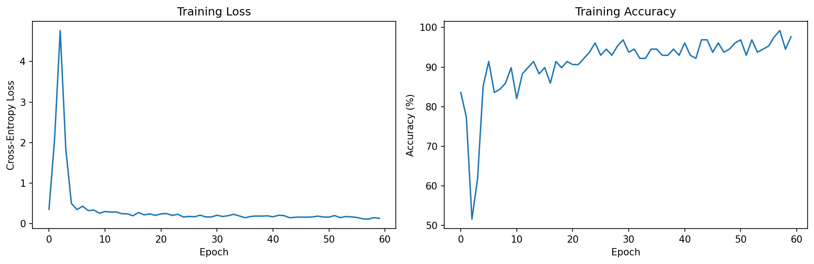
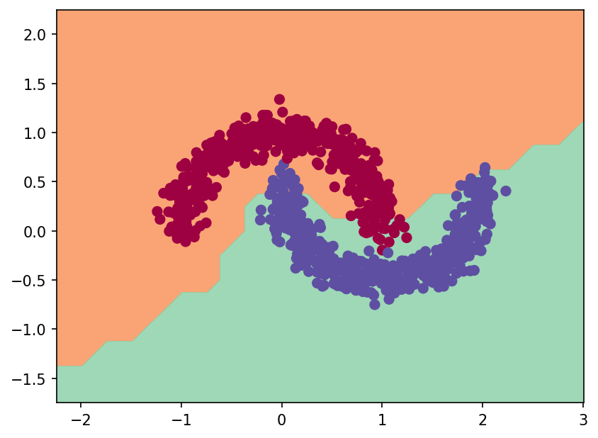
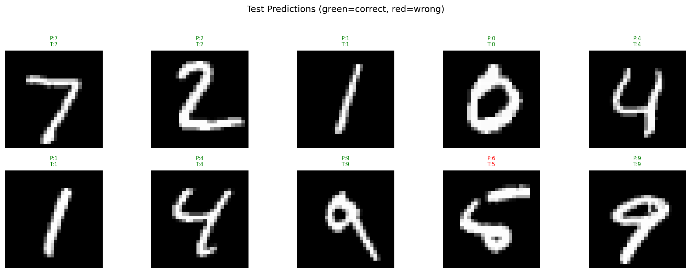

# Autograd from First Principles

This project is a deep dive into the mechanics of automatic differentiation. Inspired by Andrej Karpathy’s `micrograd`, this repository builds a backpropagation engine from the ground up.

We begin with a **scalar-based autograd engine**, where gradients are tracked on individual numbers to build intuition from first principles. Once the core ideas are clear, we scale the design to **multi-dimensional arrays (tensors)**, mimicking how modern frameworks like PyTorch operate internally.

## Project Structure

```
autograd/
│
├── scalar/                # Scalar-based reverse-mode autodiff
│   ├── engine.py          # Value class and backward propagation logic
│   ├── nn.py              # Neuron / MLP built using scalar engine
│   └── graphic.py         # Computational graph visualization
│
├── tensor/                # Tensor-based autograd engine
│   ├── engine.py          # Tensor class and gradient propagation
│   └── nn.py              # Neural network modules (tensor version)
│
notebooks/
│   ├── autograd_scalar_demo.ipynb
│   └── autograd_tensor_demo.ipynb
│
pyproject.toml             # Package configuration
README.md
```

## What is Autograd?

Autograd (automatic differentiation) is a system that computes gradients of complex functions efficiently and exactly.

Neural networks are large composite functions:

\[
L = f(g(h(x)))
\]

During training, we need the gradient of the loss with respect to **every parameter**:

\[
\frac{\partial L}{\partial \theta}
\]

Instead of symbolically differentiating the entire expression or manually applying calculus for each model, autograd works by:

1. **Recording operations** during the forward pass.
2. **Building a computational graph** that captures how each value depends on others.
3. **Storing local derivatives** for each operation.
4. **Propagating gradients backward** using the chain rule (reverse-mode autodiff).

This backward propagation of gradients through the computational graph is known as **backpropagation**.

Autograd enables gradient-based optimization such as:

\[
\theta = \theta - \alpha \frac{\partial L}{\partial \theta}
\]

The scalar engine demonstrates this process on individual values.  
The tensor engine extends the same principles to multi-dimensional arrays with broadcasting-aware gradient flow, similar to modern deep learning frameworks.

---

## Demonstration

The engines are validated through small training experiments:

- **Scalar Engine** — Trained a simple MLP on the `make_moons` dataset.
- **Tensor Engine** — Trained an MLP on a subset of the `MNIST` dataset.

These notebooks demonstrate forward passes, gradient propagation, and parameter updates using the custom autograd implementations.

### Scalar Engine

- MLP Architecture: 2 → 32 → 16 → 2
- Activation: `ReLU`
- Optimizer: Vanilla Gradient Descent
- Learning Rate: 0.01
- Loss: Binary classification loss
- Dataset: `make_moons()`
- Final Training Accuracy:`~96%`

#### Training Loss Curve

<p align="center">
  
</p>

#### Decision Boundary

<p align="center">
  
</p>

### Tensor Engine — MNIST (Subset)

- MLP Architecture: 784 → 256 → 256 → 10
- Activation: ReLU
- Optimizer: Gradient Descent
- Learning Rate: 0.001
- Loss: Cross-Entropy
- Dataset: Subset of MNIST
- Final Training Accuracy: `92%`

#### Training Loss Curve

<p align="center">
  
</p>

#### Sample Predictions

<p align="center">
  
</p>
